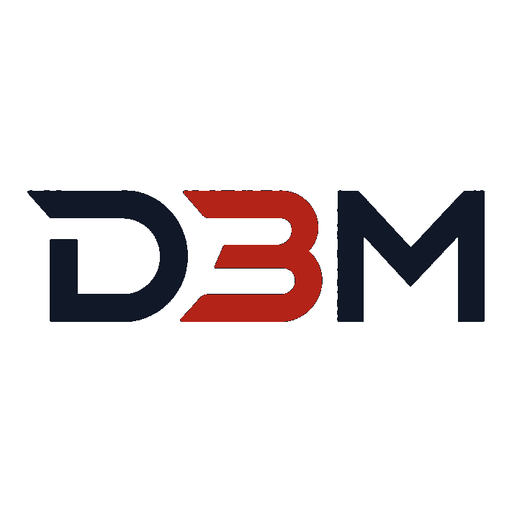

# Salih Duzen

### Senior Full Stack Software Engineer

  

**Gaithersburg, MD** · U.S. Permanent Resident (Green Card) — authorized to work for any U.S. employer, no sponsorship required

📧 salihduzen@gmail.com · 📞 +1 (240) 981-0959 · [LinkedIn](https://www.linkedin.com/in/salihduzen)

---

## About

Senior Full Stack Software Engineer with **24+ years** building enterprise web applications for **government, aviation, healthcare, and commodity trading**. Deep expertise in **Angular (v8–21)**, **Node.js**, **TypeScript**, REST/microservices, and relational/NoSQL databases.

AI-augmented engineering leader — uses **Claude (Anthropic)** and **GitHub Copilot** as daily pair-programming and code-review partners to accelerate delivery and raise code quality. Proven record delivering mission-critical systems used by millions of citizens (Istanbul Metropolitan Municipality, population 16M+). Open to **on-site, hybrid, or remote** roles.

---

## Featured product — [D3M.io](https://d3m.io)

Multi-category global classifieds platform (vehicles, real estate, marketplace, jobs, services, rentals, community) with auth, listings, messaging, favorites, media, credits, and ads.

**Stack:** Angular 21 · Node.js · Fastify · PostgreSQL · Meilisearch · Redis · Stripe-ready REST APIs

📦 Architecture & story: [salihduzenusa/d3m-io](https://github.com/salihduzenusa/d3m-io)

---

## Core skills

| Area | Technologies |
|------|----------------|
| **Frontend** | Angular (v8–21), TypeScript, JavaScript (ES6+), RxJS, NgRx, HTML5, CSS3, SASS, Bootstrap, Angular Material, PrimeNG, PWA |
| **Backend** | Node.js, Express.js, Fastify.js, REST APIs, Microservices, Socket.io, OAuth2 / OpenID Connect |
| **Databases** | PostgreSQL, MySQL, Microsoft SQL Server, Oracle, MongoDB, OrientDB, SQLite, Redis |
| **DevOps** | Git, Linux (Ubuntu), Nginx, Apache, Docker, CI/CD, Postman |
| **GIS** | ESRI ArcGIS, geospatial conversion, map-based public services |
| **AI-assisted** | Claude, GitHub Copilot, prompt engineering, human-in-the-loop quality control |
| **Also** | C#.NET, Python (IoT / Raspberry Pi), Survey.js, Power BI / SPSS export, Agile / Scrum |

---

## Experience highlights

| Role | Org | Years |
|------|-----|-------|
| Senior Frontend Developer | **Redstar Aviation** | 2023 – Mar 2026 |
| Senior Full Stack Engineer | **Heyteknoloji** | 2022 – 2023 |
| Senior Full Stack Engineer | **Albayrak Group – Pirimedya** | 2021 – 2022 |
| Senior Software Engineer | **Istanbul Metropolitan Municipality** | 2005 – 2021 |
| Software Developer | **Yaran Elektronik / Processing World** | 2003 – 2005 |

**Recent impact**
- Aviation operations platform on **Angular 17** + Microsoft Identity Server (OAuth2/OIDC) for air-ambulance coordination
- Global B2B cotton exchange — Angular 12, Node.js, MongoDB, OrientDB, Socket.io live market data
- High-volume survey platform for a major media group — Survey.js, anti-fraud fingerprinting, SPSS/Power BI pipelines
- 16 years municipal systems — VB/.NET → Angular + REST, ArcGIS citywide road digitization, fleet/garage automation for 16M+ citizens

---

## Selected projects

- **[D3M.io](https://d3m.io)** — Multi-category classifieds (Angular 21, Fastify, PostgreSQL)
- **Sevkiyatvar.com** — Freight load-matching marketplace (Angular, Node.js, OrientDB, PWA)
- **Smartdecibel.com** — IoT noise monitoring (Raspberry Pi / Python + Angular 12 / Node.js / SQLite offline)
- **Istinye State Hospital** — Cafeteria turnstile / access control (C#.NET, MySQL)

---

## Education

- **B.S., Software Engineering** — Istanbul Aydin University, Istanbul, Turkey
- **Associate Degree, Computer Programming** — Cukurova University, Adana, Turkey

## Languages

English (Working Proficiency) · Turkish (Native)

---

### Resume

📄 **[Download CV — Salih Duzen Resume 2026 (PDF)](docs/Salih_Duzen_Resume_2026.pdf)**
